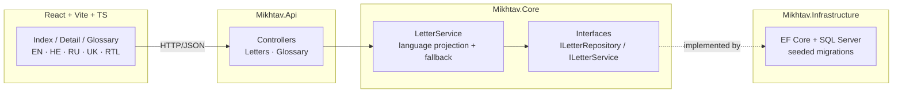

# Mikhtav · Israeli Letters Explained

> _Mikhtav_ (מכתב, "letter" in Hebrew) is a small bilingual web app that helps olim — and
> anyone struggling with Hebrew bureaucratic mail — understand the official letters that arrive
> from Israeli authorities. Pick a letter type, get a section-by-section explanation in
> **English, Hebrew, Russian, or Ukrainian**, along with what action is required and the
> deadline.

**Educational information only.** Mikhtav does not republish any government data and is not
legal advice. Verify your specific letter with the issuing authority.

**Stack:** ASP.NET Core Web API (.NET 8) · Entity Framework Core · SQL Server · React +
TypeScript (Vite) · react-i18next with full RTL · xUnit · Vitest · GitHub Actions.

---

## Architecture

A layered backend behind a thin API, with per-language content stored in the database. The
frontend picks one language per request; missing translations fall back to English so
something always renders.



**Projects**

| Project | Responsibility |
|---|---|
| `Mikhtav.Core` | Domain models, DTOs, service interfaces, `LetterService` (the language-projection logic). No framework dependencies. |
| `Mikhtav.Infrastructure` | EF Core `DbContext`, seeded migrations, the repository implementation. |
| `Mikhtav.Api` | Controllers, DI wiring, Swagger, CORS. |
| `Mikhtav.Tests` | xUnit tests for `LetterService` (Hebrew labels, language fallback, ordering). |
| `src/web` | React + TypeScript frontend, four-language UI, full RTL. |

---

## Running it

Requires the .NET 8 SDK (or newer), SQL Server LocalDB (default), and Node 20+.

```bash
# 1. Backend
dotnet tool restore
dotnet run --project src/Mikhtav.Api
# → http://localhost:5080/swagger

# 2. Frontend
cd src/web
npm install
npm run dev
# → http://localhost:5173
```

In Development the DB is created from the EF migration and seeded automatically on startup.

### Migrations

EF Core migrations are checked in under `src/Mikhtav.Infrastructure/Migrations/`. `dotnet-ef`
is a local tool — restored once with `dotnet tool restore`. New migrations:

```bash
dotnet ef migrations add <Name> \
  --project src/Mikhtav.Infrastructure \
  --startup-project src/Mikhtav.Api
```

### Tests

```bash
dotnet test                       # xUnit, language-projection logic
cd src/web && npm run test:run    # Vitest, RTL flip behaviour
```

---

## Content model

A letter type belongs to a **category** (issuing authority) and has an ordered list of
**sections**. Each section is what appears as a heading on the actual letter — stored in
Hebrew exactly as printed — plus a per-language explainer, an optional action, an optional
deadline, and a **severity** (`info` / `warning` / `critical`) that drives visual emphasis.

A separate **glossary** indexes recurring bureaucratic Hebrew terms with their transliteration
and per-language meaning.

```
LetterCategory (1) ──< LetterType (1) ──< LetterSection
BureauTerm     (independent)
```

All language columns except `*En` are nullable; the API's `LetterService` falls back to
English when the requested language is missing, so the UI never renders empty strings.

---

## Design decisions

These are the choices I'd defend in a review — no metrics I can't measure, just the reasoning.

- **Layered with interface seams.** `Core` holds the business logic and depends on nothing.
  The repository sits behind `ILetterRepository`, so `LetterService` is testable without a
  database — see `Mikhtav.Tests/LetterServiceTests.cs`.
- **Language projection at the service layer, not the database.** Storing one row per language
  would balloon the schema; storing parallel columns keeps the seed file readable and the
  fallback logic in one tiny `switch` (`LetterService.PickName` and friends).
- **HE label as the section's primary identity.** Each section's heading is stored verbatim in
  Hebrew (`LabelHe`) — that's what's printed on the user's letter. The translation never
  replaces it, only annotates it.
- **Severity drives both copy and colour.** Three buckets only: informational (blueprint blue),
  pay-attention (mustard), critical (vermillion). Same vocabulary across HE/EN/RU/UK.
- **Curated content, not OCR.** v1 doesn't try to read photos of letters. We curate the
  category, build out one type at a time, and own the editorial quality of every explainer.

---

## Roadmap

- [x] Skeleton — layered API, EF Core + migrations, React + Vite + TS + i18n + react-router
- [x] First two letter types — Bituach Leumi enrolment confirmation, Mas Hachnasa annual demand
- [x] Glossary — 15 common bureaucratic Hebrew terms with EN/RU translations
- [x] Editorial-archive design system with full RTL
- [x] Vitest + xUnit tests; CI on every push
- [ ] Ukrainian translations for the seeded content
- [ ] More letter types: Misrad HaPnim (teudat zehut renewal), Misrad HaBriut (TIPAT HALAV),
      Bituach Leumi (maternity benefit), Education ministry (school enrolment)
- [ ] Search across letter titles, section labels, and glossary
- [ ] Arabic locale
- [ ] Letter-type submission form so olim can request new explainers
- [ ] Deploy to Azure (App Service + Azure SQL + Static Web Apps)

---

## Notes & disclaimer

- This is **educational content** about common categories of letters. It is **not legal,
  financial, or immigration advice**. Verify your specific letter with the issuing authority
  (Bituach Leumi, Mas Hachnasa, Misrad HaPnim, etc.).
- No personal data is collected. The catalog is read-only in v1.
- Built with care for olim who are tired of guessing what their mail says. Tovah aliyah —
  may yours be smoother because of small tools like this.
